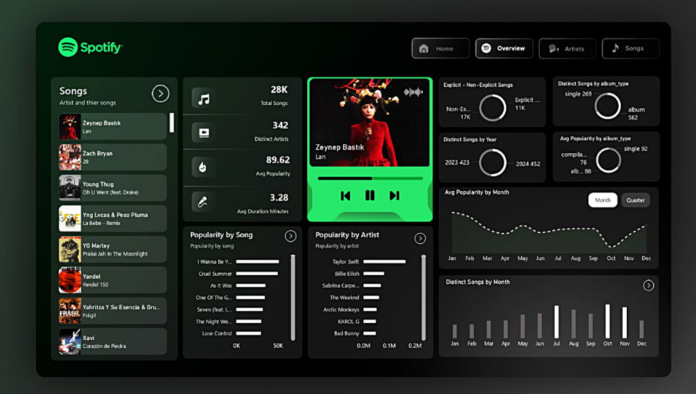

# 🎧 Spotify User Behavior Dashboard (Power BI)
## 📌 Project Overview

The Spotify User Behavior Dashboard is an interactive Power BI analytics project designed to analyze user listening behavior, content performance, and consumption trends using Spotify listening data.

The dashboard combines strong data modeling, advanced DAX, and modern UI design inspired by Spotify’s dark theme to deliver clear, actionable insights. 

## 🎯 Business Goals

- Understand user listening patterns

- Identify top artists, songs, and albums

- Analyze popularity trends over time

- Compare explicit vs non-explicit content consumption

- Detect seasonal spikes and engagement shifts

## 📊 Dataset Summary

- Total Records: ~28,000+ song entries

- Scope: Global Spotify listening & popularity data

- Level: Song-level data

- Metrics Covered: Popularity, duration, explicit content, artists, albums, dates

- Granularity: Song-level listening data

## 🧱 Data Modeling

A Star Schema was implemented for performance and scalability:

- Fact Table

- FactListening – listening events, popularity, duration, explicit flag

- Dimension Tables

- DimArtist – artist details

- DimAlbum – album & type (single, album, compilation)

- DimDate – time intelligence (year, month, quarter)

## 🧮 Key DAX Measures

- Total Songs

- Distinct Artists

- Average Popularity

- Average Duration (Minutes)

- Popularity Trend (Month / Quarter)

- Explicit vs Non-Explicit %

- Distinct Songs by Year / Month

## 📈 Dashboard Features

- 🎵 Spotify-styled dark UI

- 📊 KPI Cards (Total Songs, Artists, Avg Popularity, Avg Duration)

- 🎚️ Custom slicers (Month / Quarter / Content Type)

- 🔍 Drill-through pages for artist & song analysis

- 🧭 Navigation using bookmarks

- 📈 Trend visuals for popularity & song releases

- 📂 Breakdown by single, album, compilation
  
## 🔍 Key Insights

- Clear seasonal listening spikes across months

- Identification of high-engagement artists

- Growth trend in single releases vs albums

- Majority consumption of non-explicit content

- Monthly variation in average popularity

## 🛠 Tools & Technologies

- Power BI

- DAX

- Star Schema Data Modeling

- Data Visualization & Storytelling

## 🚀 Project Outcome

### This project demonstrates:

- End-to-end BI dashboard development

- Strong analytical thinking

- Real-world data modeling skills

- Ability to convert raw data into business insights

📌 Ideal for Data Analyst / Business Intelligence roles
